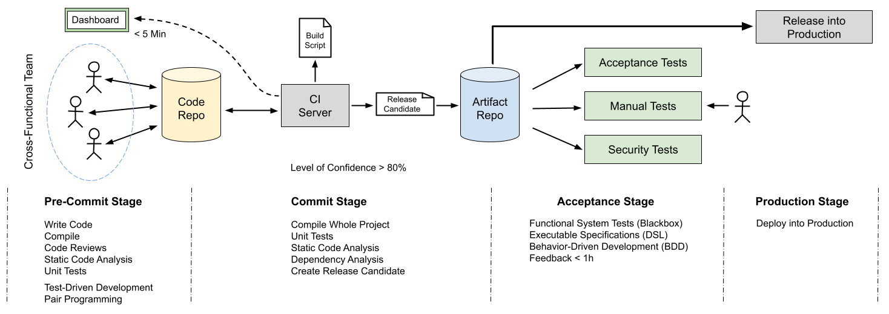

# Continuous Delivery in Embedded Systems

This repository contains examples and documentation for using Continuous Integration and Continuous Delivery in embedded systems.

* [Software Building and Packaging](build-process/)
* [Embedded Architectures](embedded-architectures/)
* Software Development Lifecycle
* Continuous Integration
* Continuous Delivery

## References

* Martin Fowler. [**Continuous Integration**](http://martinfowler.com/articles)
* Jez Humble, Davis Farley. **Continuous Delivery**. Addison-Wesley, 2010
* Davis Farley. **Continuous Delivery Pipelines**. Independently published, 2021

_Egon Teiniker, 2025, GPL v3.0_
