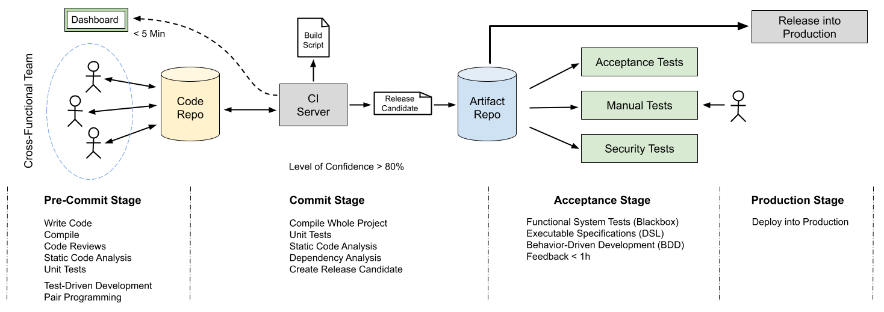

# Continuous Delivery in Embedded Systems

This repository contains examples and documentation for using Continuous Integration and Continuous Delivery in embedded systems.

* [Introduction](introduction/README.md)

* [Continuous Integration](continuous-integration/)

* [Continuous Delivery](continuous-delivery/)

## Use of Coding Agents
This repository was developed using coding agents to assist with design 
discussions, implementation, and documentation. 
All materials have been manually reviewed and verified.

## References

* Martin Fowler. [**Continuous Integration**](http://martinfowler.com/articles)
* Jez Humble, Davis Farley. **Continuous Delivery**. Addison-Wesley, 2010
* Davis Farley. **Continuous Delivery Pipelines**. Independently published, 2021

_Egon Teiniker, 2025-2026, GPL v3.0_
