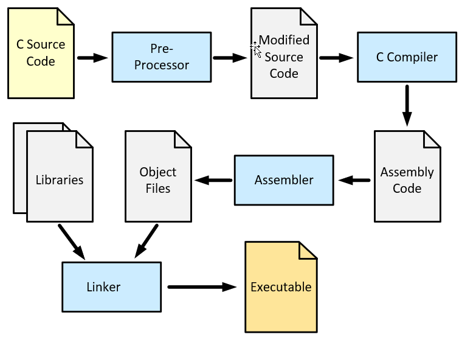

# From C/C++ Source Code to the Executable

## One Step Build 

We start our journey with a simple C++ source code example:
```C
#include <cstdio>
 
int main(void)
{
    for(int i=0; i<10; i++)
    {
       printf("Hello world!\n");
    }
    return 0;
}
```

Such a simple C++ program can be compiled into an executable with one command.
This is also the command that the Code Runner executes in VS Code.

```
$ g++ -g -Wall -o hello hello.cpp 
```

To start the executable, type:
```
$ ./build/hello
```


## Detailed Build Process 

In fact, the path from C++ source code to an executable includes several intermediate steps.



### C Preprocessor
The preprocessor modifies the source code on a text basis (`#` commands). Header files are integrated, macros are replaced, etc.

We can start the preprocessor as an independent tool called **cpp** and have the output written to its own file.

```
$ mkdir -p build
$ cpp hello.cpp build/_hello.cpp
```

After the preprocessor has run, all the information the compiler needs is in one file: `_hello.cpp`.


### Compile C++ Code into Assembly Code

The file generated by the proprocessor can be translated by the **C++ compiler** into assembler code for the respective platform.

```
$ g++ -Wall -g -S build/_hello.cpp -o build/_hello.s
```

Assembly code is not machine code. It is a human-readable form of machine code in an ASCII file: `_hello.s`.


### Convert Assembly Code to an Object File

An **assembler** called **as** translates assembly code into machine language. 
A binary file is created, the so-called **object file**.

Run the assembler
```
$ as -o build/hello.o build/_hello.s
```

Although the object file `hello.o` is a binary file, it **cannot be executed** yet. 

It is just the binary form of the original C++ source file and contains 
no startup code or library functions.

A real world program consists of a large number of C++ files and therefore 
also of many object files.

### Link the Object File into an Executable

The linker connects the object files with the necessary libraries 
(at least the standard library) to the final executable.

```
$ g++ -o build/hello build/hello.o
```

Note that a C++ library is also just a collection of object files.


### Run the Executable

The generated executable can now be started as before:

```
$ ./build/hello 
```

Note that the steps presented are always carried out, even if the intermediate files are not saved.

## References

* K. N. King. **C Programming, A Modern Approach.** W. W. Norton & Company, inc. 2nd Edition 2008. 
    * Chapter 14: The Preprocessor

*Egon Teiniker, 2025, GPL v3.0*
