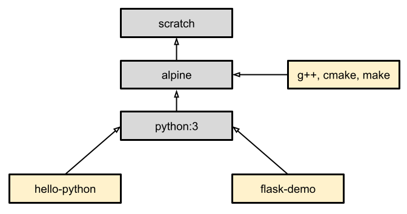

# Building Docker Images

Docker Build is one of Docker Engine's most used features. 

Whenever we are creating an image we are using Docker Build. 
Build is a key part of your software development life cycle allowing 
us to package and bundle our code and ship it anywhere.


## Image Layers

**Container images are composed of layers**. And each of these layers, once created, 
are immutable. 

Layers let us **extend images** of others by reusing their base layers, allowing us to 
add only the data that your application needs.

This is beneficial because: 
* it allows layers to be **reused between images** 
* it makes **builds faster** 
* it **reduces the amount of storage and bandwidth** required to distribute the images


_Example:_ Layers of the nginx Docker image
```bash
$ docker pull nginx

$ docker image ls -a
REPOSITORY     TAG       IMAGE ID       CREATED         SIZE
nginx          latest    9d0e6f6199dc   15 hours ago    152MB

# Show the layer-by-layer history of how the nginx image was built.
$ docker image history nginx
IMAGE          CREATED        CREATED BY                                      SIZE      COMMENT
9d0e6f6199dc   15 hours ago   CMD ["nginx" "-g" "daemon off;"]                0B        buildkit.dockerfile.v0
<missing>      15 hours ago   STOPSIGNAL SIGQUIT                              0B        buildkit.dockerfile.v0
<missing>      15 hours ago   EXPOSE map[80/tcp:{}]                           0B        buildkit.dockerfile.v0
<missing>      15 hours ago   ENTRYPOINT ["/docker-entrypoint.sh"]            0B        buildkit.dockerfile.v0
<missing>      15 hours ago   COPY 30-tune-worker-processes.sh /docker-ent…   4.62kB    buildkit.dockerfile.v0
<missing>      15 hours ago   COPY 20-envsubst-on-templates.sh /docker-ent…   3.02kB    buildkit.dockerfile.v0
<missing>      15 hours ago   COPY 15-local-resolvers.envsh /docker-entryp…   389B      buildkit.dockerfile.v0
<missing>      15 hours ago   COPY 10-listen-on-ipv6-by-default.sh /docker…   2.12kB    buildkit.dockerfile.v0
<missing>      15 hours ago   COPY docker-entrypoint.sh / # buildkit          1.62kB    buildkit.dockerfile.v0
<missing>      15 hours ago   RUN /bin/sh -c set -x     && groupadd --syst…   73.2MB    buildkit.dockerfile.v0
<missing>      15 hours ago   ENV DYNPKG_RELEASE=1~trixie                     0B        buildkit.dockerfile.v0
<missing>      15 hours ago   ENV PKG_RELEASE=1~trixie                        0B        buildkit.dockerfile.v0
<missing>      15 hours ago   ENV NJS_RELEASE=1~trixie                        0B        buildkit.dockerfile.v0
<missing>      15 hours ago   ENV NJS_VERSION=0.9.4                           0B        buildkit.dockerfile.v0
<missing>      15 hours ago   ENV NGINX_VERSION=1.29.3                        0B        buildkit.dockerfile.v0
<missing>      15 hours ago   LABEL maintainer=NGINX Docker Maintainers <d…   0B        buildkit.dockerfile.v0
<missing>      9 days ago     # debian.sh --arch 'amd64' out/ 'trixie' '@1…   78.6MB    debuerreotype 0.16
```

Each row represents a layer of the final nginx image:
* The top row is the newest layer; bottom rows are oldest
* `CREATED BY` shows which Dockerfile instruction produced it
* `SIZE` shows how large the layer is
* `<missing>` image IDs usually mean the layer came from a parent/base image


Layering is made possible by **content-addressable storage** and **union filesystems**:

* After each layer is downloaded, it is extracted into its own directory on the host filesystem.

* When we run a container from an image, a union filesystem is created where layers are stacked 
    on top of each other, creating a new and unified view.

* When the container starts, its root directory is set to the location of this unified directory, 
    using `chroot`.

When the union filesystem is created, in addition to the image layers, 
a **directory is created specifically for the running container**. 
This allows the container to make **filesystem changes** while allowing the 
original image layers to remain untouched. This enables you to run multiple 
containers from the same underlying image.


### Base Image 

A **base image** is the starting layer of a Docker image, the foundation on top 
of which all other layers are added. It’s the first image you specify in a 
`Dockerfile` using the `FROM` instruction.

The base image determines:
* **Operating system** environment
* Pre-installed **tools or runtimes** (e.g., C++, Python, Java)
* The **filesystem structure** our container starts with

Without a base image, we would have essentially no OS, no package manager, 
nothing to run code.



Docker provides a **completely empty base image** (without an OS) that serves 
as the foundation for all other images:

```dockerfile
FROM FROM scratch
#...
```

For most cases, we don't need to create our own base image. **Docker Hub** 
contains a vast library of Docker images that are suitable for use as a base 
image in our build. 

**Docker Official Images** have clear documentation, promote best practices, 
and are regularly updated. 

_Example:_ Alpine Linux base image

```dockerfile
FROM alpine:latest
#...
```

The `alpine` base image is a minimal Docker image based on **Alpine Linux** 
with a complete package index and only **5 MB** in size.

The `alpine` image uses the **Alpine Package Keeper (apk)** package manager.
apk is lightweight, fast, and designed specifically for Alpine’s minimal 
footprint. It’s used to install, update, and remove software packages inside 
Alpine-based containers.

* **Install a package**: `apk add g++`
* **Remove a package**: `apk del g++`
* **Update package index**: `apk update`
* **Upgrade installed packages**: `apk upgrade`

Alpine Linux uses the **Alpine Package** format `.apk`.
Each `.apk` file is a compressed tar archive (tar.gz or tar.xz)

We can look up apk packages in the official 
[**Alpine Linux package repositories**](https://pkgs.alpinelinux.org/packages)


## Writing a Dockerfile

A Dockerfile is a text-based document that's used to create a container 
image. It provides instructions to the image builder on the commands 
to run, files to copy, startup command, and more.

Some of the most **common instructions** in a Dockerfile include:

* `FROM <image>`: This specifies the base image that the build will extend.

* `WORKDIR <path>`: This instruction specifies the "working directory" or 
    the path in the image where files will be copied and commands will be 
    executed.

* `COPY <host-path> <image-path>`: This instruction tells the builder to 
    copy files from the host and put them into the container image.

* `RUN <command>`: This instruction tells the builder to run the specified 
    command.

* `ENV <name> <value>`: This instruction sets an environment variable that 
    a running container will use.

* `EXPOSE <port-number>`: This instruction sets configuration on the image 
    that indicates a port the image would like to expose.

* `USER <user-or-uid>`: This instruction sets the default user for all 
    subsequent instructions.

* `CMD ["<command>", "<arg1>"]`: This instruction sets the default command 
    a container using this image will run.

_Example:_ [Dockerfile for a Python image running a simple application](../docker-python/)

_Example:_ [Dockerfile for a C++ image building and running a simple application](../docker-cxx/)


## Multi-Stage Builds

With multi-stage builds, we use **multiple FROM statements** in our Dockerfile. 

Each `FROM` instruction can use a different base, and each of them begins a 
new stage of the build. We can selectively **copy artifacts from one stage to 
another**, leaving behind everything we don't want in the final image.

_Example:_ [C++ build and run stages](../docker-cxx-multi-stage/)

The end result is a **tiny production image** with nothing but the binary inside. 
None of the build tools required to build the application are included in the 
resulting image.


## References

* Images
    * [Understanding the image layers](https://docs.docker.com/get-started/docker-concepts/building-images/understanding-image-layers/)
    * [Base images](https://docs.docker.com/build/building/base-images/)

* Dockerfile
    * [Writing a Dockerfile](https://docs.docker.com/get-started/docker-concepts/building-images/writing-a-dockerfile/)
    * [Dockerfile reference](https://docs.docker.com/reference/dockerfile/)
    * [DockerHub: Docker Official Image - alpine](https://hub.docker.com/_/alpine)
    * [Dockerfile best practices](https://docs.docker.com/build/building/best-practices/)


*Egon Teiniker, 2025, GPL v3.0*
