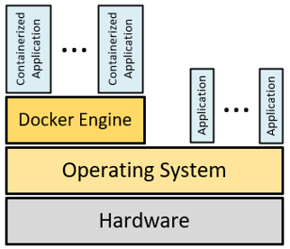

# Introduction to Docker 

Docker is virtualization technology.
The basic concept behind Docker is to **run an application, and all its 
dependencies, completely isolated**, as if only your application is 
running on a server.

The process of **deploying a software system** and running an application 
should be **repeatable**. 

A **Docker image** contains all the code and dependencies. 
This image is run each time the application needs to be run.

The Docker image can run in any Docker environment. 
The runtime environment of the Docker image is called a **Docker container**. 

Docker uses **resource isolation**, like how processes are isolated 
in the operating system kernel to **run multiple containers** on the 
**same operating system**.

Either we build a Docker image or pull the already pre-built Docker image 
from a **Docker registry**. The Docker registry stores Docker images. 
The default Docker registry is **Docker Hub**.

To create a Docker image, we create a **Dockerfile** which contains all 
the other images, dependencies, and commands.

## References

* [Docker Homepage](https://www.docker.com/)
* [Docker Engine](https://docs.docker.com/engine/)

* Jeff Nickoloff. **Docker in Action**. Manning, 2016 
* Richard Bullington-McGuire, Andrew K. Denis, Michael Schwartz. **Docker for Developers**. Packt Publishing, 2020.
* SK. Singh. **Cloud Computing and AWS Introduction: Docker | AWS Cloud Platform | Serverless Computing | Virtualization | Virtual Machine | Hypervisor | IaaS | PaaS | SaaS | FaaS | DaaS | EC2 | IAM | S3**. Independently published, 2021

*Egon Teiniker, 2025, GPL v3.0*