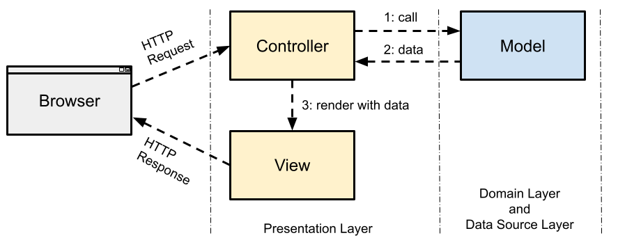

# Web Applications

A **web application** is a client-server application in which the **client is
a web browser** (or any other HTTP client, such as `curl` or a mobile app) and
the **server is a web server** that generates responses dynamically.
Client and server communicate using the **Hypertext Transfer Protocol (HTTP)**.

In embedded systems, web applications are a popular way to provide a
**user interface without a display**: a device (e.g. a Raspberry Pi, a
router, a 3D printer, or an industrial controller) runs a small web server,
and the user configures or monitors it from any browser on the network.


## HTTP Protocol 

> The **Hypertext Transfer Protocol (HTTP)** is a **stateless, text-based
> request-response protocol** for exchanging resources (HTML pages, images,
> JSON data, ...) between a client and a server.

HTTP is an application layer protocol that runs on top of a **TCP connection**
(see [Socket Programming](../../sockets/introduction/README.md)).
By default, HTTP servers listen on **port 80** and HTTPS servers
(HTTP over TLS) on **port 443**.

The communication always follows the same pattern:

1. The client opens a TCP connection to the server.
2. The client sends an **HTTP request**.
3. The server processes the request and sends an **HTTP response**.
4. The connection is closed or reused for further requests (keep-alive).

**Stateless** means that each request is independent: the server does not
remember previous requests. If an application needs state (e.g. a logged-in
user), it must be transferred with each request, typically using
**cookies** or **tokens**.


### Uniform Resource Locator (URL)

Each resource is identified by a URL:

```
http://localhost:8080/translator?word=cat&lang=de
\__/   \_______/ \__/ \________/ \______________/
scheme   host    port    path         query
```


### HTTP Request

An HTTP request consists of a **request line**, **header fields**, an
empty line, and an optional **body**:

```
POST /translator HTTP/1.1                           <- request line: method, path, version
Host: localhost:8080                                <- header fields
Content-Type: application/x-www-form-urlencoded
Content-Length: 25
                                                    <- empty line
word=cat&language=Deutsch                           <- body
```

The **HTTP method** defines what the client wants to do with the resource:

| Method     | Description                                          | Body |
|------------|------------------------------------------------------|------|
| `GET`      | Read a resource (should not change server state)     | no   |
| `POST`     | Send data to the server (e.g. submit a form, create) | yes  |
| `PUT`      | Replace a resource                                   | yes  |
| `PATCH`    | Partially modify a resource                          | yes  |
| `DELETE`   | Delete a resource                                    | no   |
| `HEAD`     | Like `GET`, but returns only the headers             | no   |


### HTTP Response

An HTTP response consists of a **status line**, **header fields**, an
empty line, and an optional **body**:

```
HTTP/1.1 200 OK                                     <- status line: version, status code, reason
Content-Type: text/html; charset=utf-8              <- header fields
Content-Length: 252
                                                    <- empty line
<!DOCTYPE html>                                     <- body
<html> ... </html>
```

The **status code** tells the client the result of the request:

| Range | Meaning       | Examples                                              |
|-------|---------------|-------------------------------------------------------|
| `1xx` | Informational | `101 Switching Protocols`                             |
| `2xx` | Success       | `200 OK`, `201 Created`, `204 No Content`             |
| `3xx` | Redirection   | `301 Moved Permanently`, `302 Found`, `304 Not Modified` |
| `4xx` | Client error  | `400 Bad Request`, `401 Unauthorized`, `404 Not Found` |
| `5xx` | Server error  | `500 Internal Server Error`, `503 Service Unavailable` |


### Important Header Fields

| Header           | Description                                                  |
|------------------|--------------------------------------------------------------|
| `Host`           | Host name and port of the server (mandatory in HTTP/1.1)     |
| `Content-Type`   | Media type of the body (`text/html`, `application/json`, ...) |
| `Content-Length` | Size of the body in bytes                                    |
| `Accept`         | Media types the client can handle                            |
| `Cookie` / `Set-Cookie` | Transfer state between client and server              |
| `Authorization`  | Credentials of the client (e.g. Basic Auth, Bearer token)    |


We can watch the HTTP messages using `curl -v`:

```bash
$ curl -v http://localhost:8080/
> GET / HTTP/1.1
> Host: localhost:8080
> User-Agent: curl/7.88.1
> Accept: */*
>
< HTTP/1.1 200 OK
< Content-Type: text/html; charset=utf-8
< Content-Length: 1160
<
<html>
...
```

Lines starting with `>` are sent by the client, lines starting with `<`
are received from the server.

**HTTP versions**: HTTP/1.1 is text-based and still the most common version
on embedded devices. HTTP/2 and HTTP/3 use binary framing and multiplexing to
improve performance, but keep the same semantics (methods, status codes,
headers).


## MVC Architectural Pattern

> The **Model-View-Controller (MVC)** pattern separates an interactive
> application into three components: the **Model** (data and business logic),
> the **View** (presentation), and the **Controller** (input handling).

The goal is a **separation of concerns**: the business logic does not
depend on how data is presented, and the user interface can be changed
without touching the business logic.

* **Model (M)**: Data and business logic.
    - Manages how data is structured, manipulated, stored, and validated.
    - Is independent of the user interface and of HTTP.

    _Example_: Service classes, data classes, database access,
    hardware access (sensor readings, GPIO, ...).

* **View (V)**: Presentation.
    - Renders the data provided by the Controller (e.g. as HTML or JSON).
    - Does not contain business logic.

    _Example_: HTML templates.

* **Controller (C)**: Handles user input.
    - Receives the HTTP request and extracts the parameters.
    - Invokes the business logic in the Model.
    - Selects a View and passes the results to it.

    _Example_: Route handler functions.


In a web application, an HTTP request is processed as follows:



1. The browser sends a request, which is dispatched to a Controller.
2. The Controller calls the Model and receives the results.
3. The Controller passes the results to a View, which generates the
   HTTP response (e.g. an HTML page).

**Benefits**:
* Business logic can be **tested without a web server** (unit tests of the Model).
* The same Model can be used by **different Views** (HTML page for users,
  JSON API for other programs).
* Developers can work on the user interface and the business logic in parallel.


## Flask 

[Flask](https://flask.palletsprojects.com/) is a lightweight web framework
for Python. It is called a **micro-framework** because its core is small:
it provides routing, request/response handling, and templating, while
everything else (database access, authentication, forms, ...) can be added
via extensions when needed.

Flask is built on two libraries:
* **Werkzeug**: WSGI toolkit for HTTP request/response handling and routing.
* **Jinja2**: Template engine to generate HTML pages.


### Flask in Embedded Systems

Flask is a popular choice for web interfaces on **embedded Linux devices**
(Raspberry Pi, BeagleBone, industrial gateways, ...):

* **Small footprint**: Few dependencies, low memory usage, fast startup.
  A Flask application can be a single Python file.

* **Easy hardware integration**: The route handlers are ordinary Python
  functions, so they can directly use Python libraries for GPIO, I2C, SPI,
  UART (`pyserial`), or sensors.

* **HTML and REST APIs**: The same application can serve HTML pages for
  users and JSON data for other programs (e.g. a monitoring system or a
  mobile app) using `jsonify()`.

* **Built-in development server**: No separate web server installation is
  needed for development and testing.

* **Testability**: Flask provides a test client (`app.test_client()`) to
  send requests to the application without starting a server, which
  integrates well into a CI pipeline (e.g. with `pytest`).

Limitations and things to consider:

* The built-in development server (`app.run()`) is **not intended for
  production**. On a device, use a WSGI server such as `waitress` or
  `gunicorn` (optionally behind `nginx`).
* Never enable `debug=True` on a deployed device: the interactive debugger
  allows **remote code execution**.
* Flask requires a full Python interpreter and an operating system. On
  **microcontrollers** (MicroPython on ESP32, Raspberry Pi Pico W),
  Flask-like frameworks such as [Microdot](https://github.com/miguelgrinberg/microdot)
  can be used instead.


### Implementing a Web Application with Flask

Install Flask (preferably in a virtual environment):

```bash
$ python -m venv .venv
$ source .venv/bin/activate

$ pip install flask
```

A typical Flask project has the following structure:

```
app.py              # Controller: Flask application and route handlers
translator.py       # Model: business logic (no Flask dependency)
templates/          # View: Jinja2 HTML templates
    index.html
    translation.html
static/             # Static files: CSS, JavaScript, images (optional)
```

The implementation follows these steps:

* **Create the application object**

```python
from flask import Flask, render_template, request, jsonify

app = Flask(__name__)
```

* **Define routes (Controller)**: The `@app.route()` decorator maps a URL
  path (and HTTP methods) to a Python function. The function's return value
  becomes the HTTP response.

```python
@app.route('/')
def index():
    return render_template('index.html')
```

* **Read request data**: The `request` object gives access to the HTTP request.

| Expression                   | Data source                         |
|------------------------------|-------------------------------------|
| `request.args.get('word')`   | Query parameters of the URL (`GET`) |
| `request.form.get('word')`   | Form data in the body (`POST`)      |
| `request.get_json()`         | JSON body                           |
| `request.method`             | HTTP method                         |
| `request.headers`            | Header fields                       |

* **Call the Model and render a View**: `render_template()` loads a
  template from the `templates/` directory and fills in the placeholders.

```python
@app.route('/translator', methods=['POST'])
def translate():
    word = request.form.get('word')
    translation = TranslatorServiceGerman().translate(word)
    return render_template('translation.html', word=word, translation=translation)
```

```html
<h2>Translate: {{ word }} into {{ translation }}</h2>
<a href="{{ url_for('index') }}">Back</a>
```

  Jinja2 automatically **escapes** values in `{{ ... }}`, which protects
  against Cross-Site Scripting (XSS).

* **Return JSON (REST API)**: For machine-to-machine communication, a route
  can return JSON data and a status code instead of HTML.

```python
@app.route('/api/temperature', methods=['GET'])
def temperature():
    value = sensor.read_temperature()   # Model: hardware access
    return jsonify({'temperature': value, 'unit': 'C'}), 200
```

* **Start the server**

```python
if __name__ == '__main__':
    app.run(host='0.0.0.0', port=8080, debug=True)
```

  - `host='127.0.0.1'` (default): Only reachable from the device itself.
  - `host='0.0.0.0'`: Reachable from other machines in the network
    (required to access an embedded device from a browser on a PC).

```bash
$ python app.py
$ curl http://localhost:8080/
```

* **Test the application**: The test client sends requests without a
  running server.

```python
def test_index():
    client = app.test_client()
    response = client.get('/')
    assert response.status_code == 200
```

A complete example is the [Translator](../translator/README.md) web application.


## References

* [RFC 9112: HTTP/1.1](https://www.rfc-editor.org/rfc/rfc9112)
* [Flask Documentation](https://flask.palletsprojects.com/)
* [Jinja Documentation](https://jinja.palletsprojects.com/)

* Martin Fowler. **Patterns of Enterprise Application Architecture**. Addison-Wesley, 2002.


_Egon Teiniker, 2025-2026, GPL v3.0_
