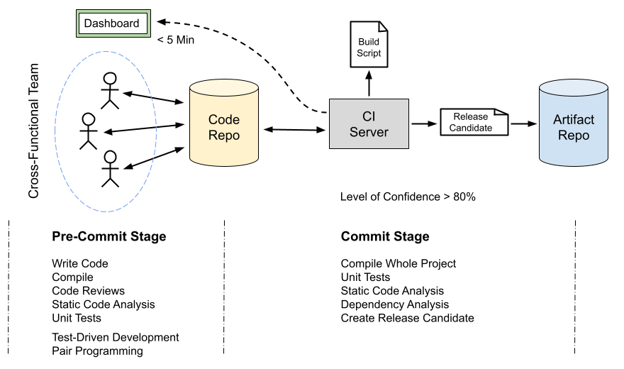

# Continuous Integration 

> **Continuous Integration (CI)** is a software development practice where 
> members of a team integrate their work frequently, usually each person 
> integrates at least daily – leading to multiple integrations per day.

## Pre-Commit Stage 

In the pre-commit stage, developers create the **design**, the **implementation** 
and **test cases** in cross functional teams.

Each developer works on his own computer and checks the changes into the code 
repository at least **once a day**.

### Cross-Functional Team

A **cross-functional team** contains all the skills required to take an idea 
from concept all the way to production without needing to hand work off to 
another team.

### Test-Driven Development 

**Test-Driven Development (TDD)** is a software development practice in which 
we **write tests before writing the code that implements the desired behavior**. 
It’s one of the core engineering practices advocated by Kent Beck.

The TDD Cycle:
* **Red**: Write a failing test
    - We write a small, specific test that describes a behavior we want.
    - The test fails because the feature doesn’t exist yet.
    - This ensures the test is valid.

* **Green**: Write the simplest implementation to pass the test
    - We write only the code needed to make the test pass.
    - No architecture, no abstraction - just the minimum required behavior.

* **Refactor**: Clean up code and test
    - Improve design: remove duplication, clarify names, simplify logic.
    - Since the test now passes, we can refactor with confidence.
    
We repeat this cycle dozens of times per day.

**TDD is not just about testing**,  it’s primarily about:

* **Better design**: TDD forces us to design from the outside in:
    - How the code will be used
    - What the behavior should be
    - What the API should look like before we implement it.

* **Continuous and fast feedback**: We know within seconds when changes 
    break something.

* **High confidence to change or refactor**: A comprehensive test suite 
    acts as a safety net.

* **Smaller, cleaner, more modular code**: Because tests enforce 
    small steps and good separation of concerns.

* **Fewer bugs**: Many defects never appear because tests express 
    the intended behavior upfront.

### Pair Programming 

Pair programming is a core technique used in **Extreme Programming (XP)**, 
a type of agile software development methodology. It involves
**two programmers working together at one workstation to develop a software component**. 

Here’s how it typically works:

* **Roles**: The two programmers assume distinct roles:
    * The **Driver** writes the code, focusing on the implementation of 
    a specific task. This role involves typing out the code but also involves 
    immediate decision-making about the details of the coding.
    * The **Navigator** reviews the code as it's written, thinking about the 
    big picture, considering long-term implications, spotting errors, and 
    suggesting improvements. The navigator might also research solutions 
    to problems or consult documentation as the driver codes.

* **Collaboration**: Throughout the process, the two programmers continuously 
    communicate, discussing strategies, solutions, and potential problems. 
    This constant dialogue is critical for spotting mistakes early, brainstorming 
    solutions, and ensuring that the code adheres to the project's standards and goals.

* **Switching Roles**: Periodically, the pair might switch roles. This practice 
    ensures that both programmers stay engaged and gain a deeper understanding of 
    the codebase. It also promotes knowledge transfer, as each programmer brings 
    their own skills and insights to the project.

* **Benefits**: Pair programming is believed to enhance code quality, reduce bugs, 
    foster knowledge sharing, and accelerate the development process. 
    It’s particularly effective for complex or critical tasks that benefit from 
    diverse perspectives. It also aids in creating a collective code ownership and 
    improves the skills of both programmers through continuous feedback.

* **Challenges**: Despite its benefits, pair programming can be challenging. 
    It requires excellent communication skills, compatibility between team members, 
    and a willingness to collaborate closely. 
    Moreover, it might not be as effective for simple tasks that don’t require much 
    discussion or for programmers with significantly different skill levels.

* **Adaptability**: While traditional pair programming involves two programmers working 
    side by side, modern practices have adapted to include remote pair programming, 
    where programmers collaborate online using shared coding environments and 
    communication tools.

In summary, pair programming is a **collaborative approach** that leverages the skills 
and insights of two programmers working in tandem to **improve code quality**, **enhance 
learning**, and **accelerate development**. It embodies the principles of Extreme 
Programming by emphasizing teamwork, feedback, and continuous improvement.

### GenAI Integration 

From the practical perspective, we have to integrate GenAI into the 
**Software Development Cycle (SDL)**.

A promising approach is to use **GenAI as a programming pair**:

**GenAI can play both roles in the context of pair programming**, albeit with 
some adjustments and considerations: 

* **As the Driver**
    * **Writing Code**: GenAI can generate code snippets based on specific 
        instructions, similar to a human driver. You can ask it to write functions, 
        debug code, or implement algorithms.
    * **Implementing Solutions**: It can take a set of requirements and turn them 
        into a working piece of code, offering various solutions or alternatives 
        when possible.
    * **Following Directions**: Just as a human driver would, GenAI can follow 
        the navigator's strategic directions, implementing the ideas and feedback 
        it receives.

* **As the Navigator**
    * **Reviewing Code**: While GenAI can review code to some extent, its ability 
        to catch complex bugs or understand deep implications of certain implementations 
        in real-time is limited compared to a human expert. 
        It can, however, suggest best practices and identify simple syntax or logical errors.
    * **Providing Feedback**: It can offer insights on code optimization, readability, 
        and adherence to programming standards. GenAI can also suggest improvements or 
        alternative approaches to a problem.
    * **Research and Documentation**: GenAI can provide explanations, documentation 
        references, and examples for a wide range of programming concepts and languages, 
        aiding in the research part of the navigator's role.

* **Limitations and Considerations**
    * **Real-Time Collaboration**: GenAI’s static nature means it cannot dynamically 
        interact in real-time like a human pair. The feedback loop is slower, as you need 
        to input queries and wait for responses.
    * **Contextual Understanding**: While it can understand and retain context to a degree 
        within a conversation, its ability to keep track of an evolving codebase or project 
        intricacies in real-time is limited compared to a human.
    * **Complex Debugging**: For more complex debugging tasks, especially those that require 
        understanding of the broader system or external dependencies, GenAI's capabilities 
        may not be as effective as a human expert's.

GenAI can play roles akin to both the driver and the navigator in pair programming, 
providing a valuable resource for coding, learning, and problem-solving. 
However, **its effectiveness is maximized when used as a complement to human expertise**, 
rather than a complete substitute, due to the dynamic and complex nature of software 
development tasks.

## Commit Stage 

## Artifact Repository

## Essential Practices

* Don't check in on a broken build

* Always run all commit tests locally before commiting

* Wait for commit tests to pass before moving on

* Never go home on a broken build

* Always be prepared to revert to the previous revision.

* Time-box fixing before reverting 

* Don't comment out failing tests

* Take responsibility for all breakages that result from your changes

## References

* Kent Beck. Extreme Programming Explained. Addison-Wesley, 2000
* [YouTube (Continuous Delivery): You Must Be CRAZY To Do Pair Programming](https://youtu.be/aItVJprLYkg)

* Jez Humble, Davis Farley. **Continuous Delivery**. Addison-Wesley, 2010
* Davis Farley. **Continuous Delivery Pipelines**. Independently published, 2021

