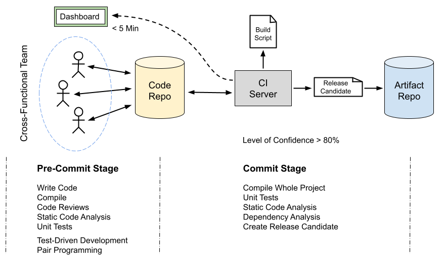

# Introduction to Continuous Integration 

> **Continuous Integration (CI)** is a software development practice where 
> members of a team integrate their work frequently, usually each person 
> integrates at least daily – leading to multiple integrations per day.

## Pre-Commit Stage 

In the pre-commit stage, developers create the **design**, the **implementation** 
and **test cases** in cross functional teams.

Each developer works on his own computer and checks the changes into the code 
repository at least **once a day**.

## Commit Stage 

The Commit Stage is where we get fast, efficient feedback on any changes, so 
that the developer gets a high level of confidence that the code does what 
they expect it to. 

**The output of a successful Commit Stage is a Release Candidate**.

The goal of the Commit Stage is to achieve a high level of confidence that our 
changes are good enough to proceed, and to achieve that confidence as quickly 
as we can.

The Commit Stage is where we do the **fast unit and technical tests**, best 
suited to getting **results in a few minutes**, and we leave other, more 
complex and comprehensive tests to later in the Deployment Pipeline.

There are other valuable tests that should be included:

* Analysis to check whether our **coding standards** are met
* **Compiler warnings** 
* **Static code analysis** tools (linter, etc.)
* **Dependency analysis** (library scanns)
* ...

> Commit Stage tests should provide quality feedback to the developer 
> within 5 minutes.

The Commit Stage is complete when all the technical, developer-centred 
tests pass.
Now the developer has a **high level (`>80%`) confidence** tht their code 
does what they expect it to.

We package the result of a successful Commit Stage to create a 
**Release Candidate (RC)**.
This should be the code that we will be deployed into production.

## Artifact Repository

The Artifact Repository is the **cache of Release Candidates**. 
The Deployable Units of software that are produced from a successful 
Commit Stage are assembled and packaged into Release Candidates and 
stored in the Artifact Repository. 

There are excellent open source tools for this, but at its simplest, an Artifact 
Repository only requires an **allocated Folder**.

The Artifact Repository is the version of truth. **The Release Candidates 
stored here are the exact bits and bytes that we intend to deploy into 
production**.

We will store successful outputs of the Commit Stage in the form that 
they will be deployed into the rest of the Deployment Pipeline - the test 
environment and into production. 

We separate out any environment-specific configuration from the Release Candidate. 
Modern **container systems** (such as Docker) make this easier. 
**We use the same deployment mechanisms wherever we deploy**.

When working well, we may produce Release Candidate every 10-15 minutes.
But we only need to progress the **newest Release Candidate** and we can 
discard any earlier, or failing versionfrom the Artifact Repository.

Each Release Candidate will be assigned a **unique ID**. This is best 
done as a simple sequence number, so we can easily identify which, of 
several possible versions, is the newest.

## Essential CI Practices

* Don't check in on a broken build.

* Always run all commit tests locally before commiting.

* Wait for commit tests to pass before moving on.

* Never go home on a broken build.

* Always be prepared to revert to the previous revision.

* Time-box (`<10` minutes) fixing before reverting. 

* Don't comment out failing tests.

* Take responsibility for all breakages that result from your changes.

## References

* Kent Beck. Extreme Programming Explained. Addison-Wesley, 2000
* [YouTube (Continuous Delivery): You Must Be CRAZY To Do Pair Programming](https://youtu.be/aItVJprLYkg)

* Jez Humble, Davis Farley. **Continuous Delivery**. Addison-Wesley, 2010
* Davis Farley. **Continuous Delivery Pipelines**. Independently published, 2021

_Egon Teiniker, 2025-2026, GPL v3.0_