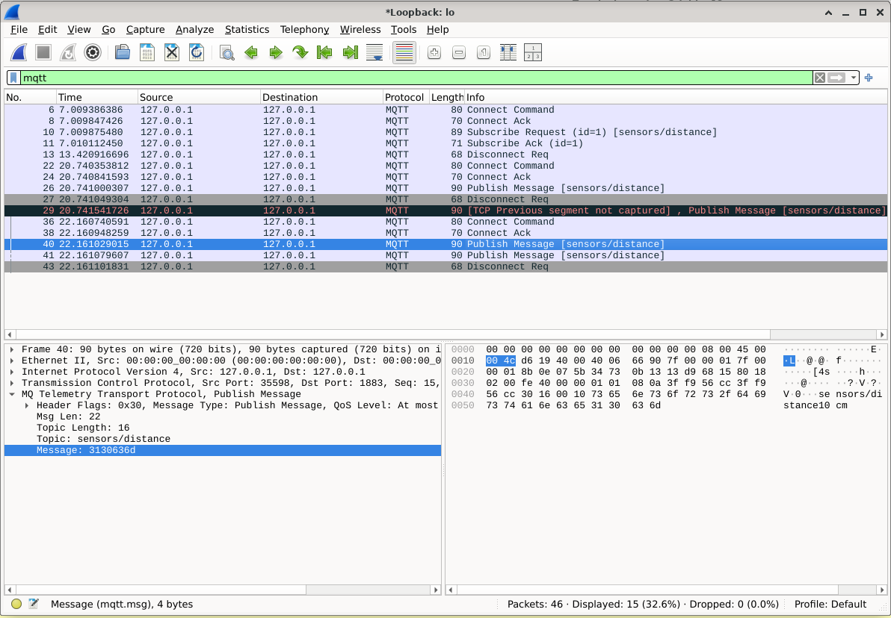

# Wireshark 

Wireshark is a **network protocol analyzer** used to capture, inspect, 
and troubleshoot network traffic. 



* **Packet Capture**: This is the core functionality. 
    Wireshark captures real-time traffic from a network interface.

    - Choose which network interface ( Loopback: lo, Ethernet, Wi-Fi, etc.) to capture from.
    - Capture filters can limit what is recorded (e.g., mqtt, http).

* **Packet List Pane**: 
    Shows every captured packet in a table format with:
    - Timestamp
    - Source IP
    - Destination IP
    - Protocol
    - Packet length
    - Info summary

    This is where you select a packet to inspect.

* **Packet Details Pane**:
    Displays the selected packet as a decoded protocol tree.
    Great for analyzing headers and finding misconfigurations.

* **Packet Bytes Pane*:
    Shows the raw hexadecimal and ASCII representation of the packet.

* **Display Filters**:
    Wireshark has powerful filtering like:
    - ip.addr == 192.168.1.1
    - tcp.port == 80
    - mqtt
    - http
    - dns
    - tcp.flags.syn == 1

    Display filters let us search through captured packets without 
    altering the capture.    

## Setup 

We can use the Debian package manager:

```bash
$ sudo apt update
$ sudo apt install wireshark 
```

Note that Wireshark is already installed in the Debian VM image.

To start Wireshark as regular user, we have to add the user to the **wireshark group**:

```bash
# Add user to the wireshark group
$ sudo usermod -aG wireshark $USER

# group membership without logging out
$ newgrp wireshark
```

Wireshark can now access network interfaces without sudo.


## Capture MQTT Traffic in Wireshark

Start Wireshark:

```bash
$ wireshark
```

* Network interface:  `Loopback: lo`
* Filter: `mqtt` or `tcp.port == 1883`

With **TLS/SSL (port 8883)**, MQTT **payloads are encrypted** and cannot be inspected 
unless you decrypt the TLS session.

Important MQTT Message Types:
 `CONNECT`: Client requests connection
* `CONNACK`: Broker accepts connection
* `PUBLISH`: Publish a message
* `SUBSCRIBE`: Client requests topic subscription
* `SUBACK`: Broker confirms subscription
* `PINGREQ`: Heartbeat request
* `PINGRESP`: Heartbeat reply

We can filter the **message type**:
* `mqtt.msgtype == 3`: Show only `PUBLISH` messages
* `mqtt.msgtype == 8`: Only `SUBSCRIBE` messages
* `mqtt.topic == "sensors/distance"`: Filter by Topic


## References

* [YouTube (Chris Greer): Wireshark Masterclass](https://youtube.com/playlist?list=PLW8bTPfXNGdC5Co0VnBK1yVzAwSSphzpJ&si=n7YD2PmMzd6jW9ZM)

* [Homepage: Wireshark](https://www.wireshark.org/)

* [Wireshark User’s Guide](https://www.wireshark.org/docs/wsug_html_chunked/)


_Nicoletta Kähling, Egon Teiniker, 2025, GPL v3.0_