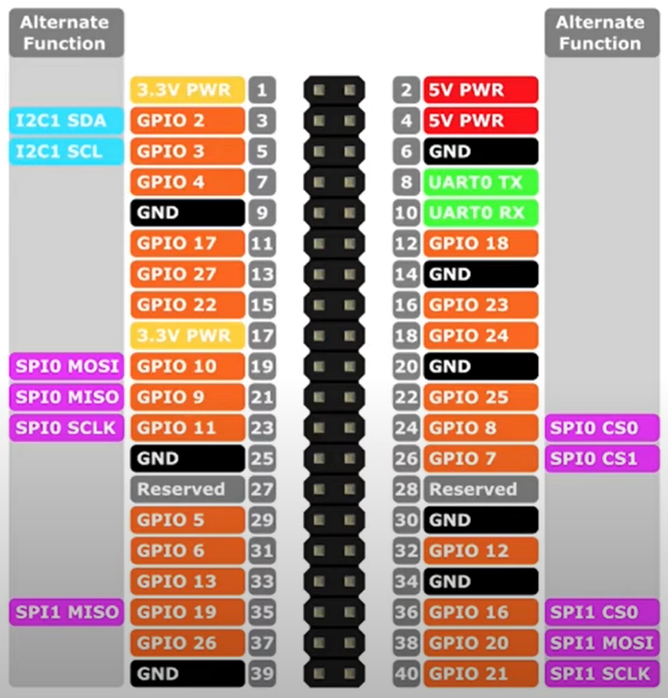

# Raspberry Pi GPIO Header

## GPIO Header Layout

The Raspberry Pi features a 40-pin **GPIO (General Purpose Input/Output)** 
header that allows us to connect external devices such as sensors, actuators, 
displays, and other peripherals. 

The pinout is **backward compatible** with previous Raspberry Pi models, 
ensuring that most existing hardware add-ons and **HATs (Hardware Attached 
on Top)** work seamlessly.

| Pin   | Name      | Function            |
|-------|-----------|---------------------|
| 1	    | 3.3V	    | **3.3V power supply** |
| 2	    | 5V	    | **5V power supply**   |
| 3	    | GPIO 2	| I2C1 SDA (Data Line)  |
| 4	    | 5V	    | **5V power supply**   |
| 5	    | GPIO 3	| I2C1 SCL (Clock Line) | 
| 6	    | Ground	| **Ground**        |   
| 7	    | GPIO 4	| General-purpose input/output | 
| 8	    | GPIO 14	| UART TXD (Transmit Data) | 
| 9	    | Ground	| **Ground**    | 
| 10	| GPIO 15	| UART RXD (Receive Data) | 
| 11	| GPIO 17	| General-purpose input/output | 
| 12	| GPIO 18	| PCM_CLK (Pulse Code Modulation Clock) | 
| 13	| GPIO 27	| General-purpose input/output | 
| 14	| Ground	| **Ground** | 
| 15	| GPIO 22	| General-purpose input/output | 
| 16	| GPIO 23	| General-purpose input/output | 
| 17	| 3.3V	  | **3.3V power supply** | 
| 18	| GPIO 24	| General-purpose input/output | 
| 19	| GPIO 10	| SPI0 MOSI (Master Out, Slave In) | 
| 20	| Ground	| **Ground** | 
| 21	| GPIO 9	| SPI0 MISO (Master In, Slave Out) | 
| 22	| GPIO 25	| General-purpose input/output | 
| 23	| GPIO 11	| SPI0 SCLK (Clock Line) | 
| 24	| GPIO 8	| SPI0 CE0 ( Chip Enable 0) | 
| 25	| Ground	| **Ground** | 
| 26	| GPIO 7	| SPI0 CE1 (Chip Enable 1) | 
| 27	| GPIO 0	| I2C EEPROM Data Line / ID_SD | 
| 28	| GPIO 1	| I2C EEPROM Clock Line / ID_SC | 
| 29	| GPIO 5	| General-purpose input/output | 
| 30	| Ground	| **Ground** | 
| 31	| GPIO 6	| General-purpose input/output | 
| 32	| GPIO 12	| PWM (Pulse Width Modulation) | 
| 33	| GPIO 13	| PWM (Pulse Width Modulation) | 
| 34	| Ground	| **Ground** | 
| 35	| GPIO 19	| PCM_FS (Frame Sync for Pulse Code Modulation) | 
| 36	| GPIO 16	| General-purpose input/output | 
| 37	| GPIO 26	| General-purpose input/output | 
| 38	| GPIO 20	| PCM_DIN (Data In for Pulse Code Modulation) | 
| 39	| Ground	| **Ground** | 
| 40	| GPIO 21	| PCM_DOUT (Data Out for Pulse Code Modulation) | 

**Pin Descriptions**:

1. **Power Pins**
  - **Pins 1 and 17**: 3.3V power supply.
    3.3V Pin: **max 50-100mA** (only for low-power sensors & GPIO logic).
  - **Pins 2 and 4**: 5V power supply.
    5.0V Pin: Can provide up to **2.5A-3A**, depending on the Pi model 
      and power supply.
  - **Pins 6, 9, 14, 20, 25, 30, 34, 39**: Ground (GND).

2. **GPIO Pins**
  - GPIO pins can be used for input or output and configured via software. 
  - **General-purpose input/output pins**:
	  - Pin  7: GPIO 4	(GPCLK0)
	  - Pin 29: GPIO 5 		
	  - Pin 31: GPIO 6		
	  - Pin 32: GPIO 12	(PWM0)
	  - Pin 33: GPIO 13	(PWM1)
	  - Pin 36: GPIO 16		
	  - Pin 11: GPIO 17 	
	  - Pin 35: GPIO 19	(PCM_FS)
	  - Pin 38: GPIO 20	(PCM_DIN)
	  - Pin 40: GPIO 21	(PCM_DOUT)
	  - Pin 15: GPIO 22		
	  - Pin 16: GPIO 23 	
	  - Pin 18: GPIO 24 	
	  - Pin 22: GPIO 25		
	  - Pin 37: GPIO 26		
	  - Pin 13: GPIO 27		

    **Never exceed 16mA per pin	and 50mA total current**.

3. **Special Functions**
  - **UART (Universal Asynchronous Receiver-Transmitter)**:
    - Pin 8 (GPIO14): TXD (Transmit Data).
    - Pin 10 (GPIO15): RXD (Receive Data).

  - **I2C (Inter-Integrated Circuit)**:
    - Pin 3 (GPIO2): SDA (Data Line).
    - Pin 5 (GPIO3): SCL (Clock Line).

    The Raspberry Pi has **built-in 1.8kΩ pull-ups to 3.3V on SDA & SCL**.

  - **SPI (Serial Peripheral Interface)**:
    - Pin 19 (GPIO10): MOSI (Master Out Slave In).
    - Pin 21 (GPIO9): MISO (Master In Slave Out).
    - Pin 23 (GPIO11): SCLK (Clock Line).
    - Pin 24 (GPIO8): CE0 (Chip Enable 0).
    - Pin 26 (GPIO7): CE1 (Chip Enable 1).
  - **PWM (Pulse Width Modulation)**:
    - Pin 12 (GPIO18) and Pin 32 (GPIO12) are commonly used for hardware PWM.

4. **EEPROM ID Pins (for HAT compatibility)**
  - **Pin 27 (ID_SD)**: EEPROM Data Line.
  - **Pin 28 (ID_SC)**: EEPROM Clock Line.
  - These pins allow the Raspberry Pi to read an EEPROM on HAT devices to identify and configure the connected hardware automatically.

## References

* [Complete Raspberry Pi Pins Overview GPIO Header](https://youtu.be/dB-4nVc0s10?si=VAScK2Yjn3OSrd4m)