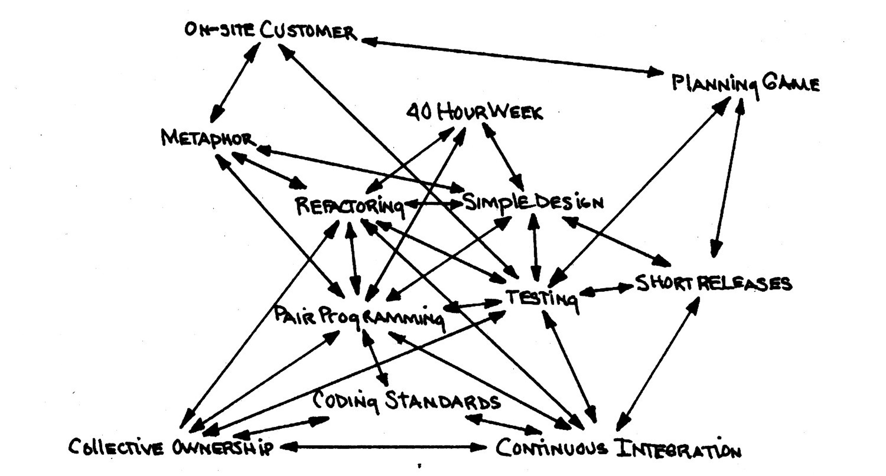

# Extreme Programming 

> **Extreme Programming (XP)** is a lightweight methodology for 
> small-to-medium-sized teams developing software in the face of 
> vague or rapidly changing requirements.

XP is designed to work with projects that can be built by teams 
of **two to ten programmers**.

## XP Practices

_Figure: XP Practices (Beck, 2000)_

* **The planning game**: Quick determine the scope of the next release by 
    combining business priorities and technical estimates. 
    As reality overtakes the plan, update the plan.

* **Small releases**: Put a simple system into production quickly, then 
    release new versions on a very short cycle.
    
* **Metaphor**: Guide all development with a simple shared story of how 
    the whole system works.

* **Simple Design**: The system should be designed as simple as possible 
    at any given moment. Extra complexity is removed. 

* **Testing**: Programmers continually write unit tests, which must run 
    flawlessly for development to continue. Customers write tests 
    demonstrating that features are finished.

* **Refactoring**: Programmers restructure the system without changing 
    its behavior to remove duplication, improve communication, simplify, 
    or add flexibility.

* **Pair programming**: All production code is written with two programmers 
    at one machine.

* **Collective ownership**: Anyone can change any code anywhere in the 
    system at any time.

* **Continuous integration**: Integrate and build the system many times 
    a day, every time a task is completed.

* **40-hour week**: Work no more than 40 hours a week as a rule. Never work 
    overtime a second week in a row.

* **On-site customer**: Include a real, live user on the team, available 
    full-time to answer questions.

* **Coding standard**: Programmers write all code in accordance with rules 
    emphasizing communication through the code.

Any one practice doesn’t stand well on its own (with the possible exception 
of testing). They require the other practices to keep them in balance.

A line between two practices means that the two practices reinforce each other. 

## Design Strategy

We will **continually refine the design** of the system, starting from a very 
simple beginning. We will remove any flexibility that doesn’t prove useful.

* **Start with a test**, so we know when we are done. 
    We have to do a certain amount of design just to write the test: What are 
    the objects and their visible methods?

* **Design and implement just enough to get that test running**. 
    We will have to design enough of the implementation to get this test and 
    all previous tests running.

Designing in this style, we will implement something in a very simple way 
the first time. The second time we use it, we will make it more general 
(**refactoring**). 
This way we **never pay for flexibility we don’t use**.

**Today’s design should be done today and tomorrow’s design should be done tomorrow.**

There is nothing wrong with designing software using explicit pictures instead 
of a purely mental or textual model of the system. The trouble with pictures is 
that they can’t give us concrete feedback. 

## Development Strategy

We will carefully craft a solution for today’s problem today, and trust that we 
will be able to solve tomorrow’s problem tomorrow.

* **Continuous Integration**: 
    No code sits unintegrated for more than a couple of hours. At the end of every 
    development episode, the code is integrated with the latest release and all 
    the tests must run at 100%. 
    It is important to have tools that support a fast integration / build / test 
    cycle. We also need a reasonable complete test suite that runs in a few minutes.

* **Collective Ownership**: 
    One of the effects of collective ownership is that complex code does not live 
    very long. Collective ownership also tends to spread knowledge of the system 
    around the team.

* **Pair programming**: Pair programming encourages communication.
    While one partner is busy typing, the other partner is thinking at a more 
    strategic level. 

## Testing Strategy

We will **write tests before we code**, minute by minute.
We will preserve these tests forever, and run them all together frequently.
We will also derive tests from the customer’s perspective.

The programmers write **tests method-by-method**. These **unit tests** always run at 100%.

The customers write tests **story-by-story**. The functional tests don’t necessarily 
run at 100% all of the time. The tester’s job is to translate the sometimes vague 
testing ideas of the customer into real, automatic, isolated tests.

## Planning Strategy

We will plan by quickly making an overall plan, then refining it further and further 
on shorter and shorter time horizons - years, months, weeks, days.

We will make the plan quickly and cheaply, so there will be little inertia when we
must change it.

* **Do only the planning you need for the next horizon**: That is the next release, 
    the end of the next iteration. We should cover this release in great detail and 
    cover the next releases with a set of bullet items.

* **Accepted responsibility**: Responsibility can only be accepted, not given. 
    The project manager has to ask the team to take responsibility for doing the work. 
    And then listen to the answer.

* **The person responsible for implementing gets to estimate**: If the team takes 
    responsibility for getting something done, they get to say how long it will take.

* **Ignore dependencies between parts**: Plan as if the parts of development can 
    be switched around at will. As long as we are careful to implement the highest 
    business priorities first, this simple rule will work.

* **Planning for priorities vs. planning for development**: Planning so that the 
    customer can establish priorities needs much less detail to be valuable than 
    planning for implementation, where we need specific test cases.

The goal of the **Planning Game** is to maximize the value of software produced by 
the team.
The strategy for the team is to invest as little as possible to put the most valuable 
functionality into production as quickly as possible.

## References

* Kent Beck. **Extreme Programming Explained**. Addison-Wesley, 2000
* Kent Beck, Martin Fowler. **Planning Extreme Programming**. Addison-Wesley, 2001

_Egon Teiniker, 2025, GPL v3.0_