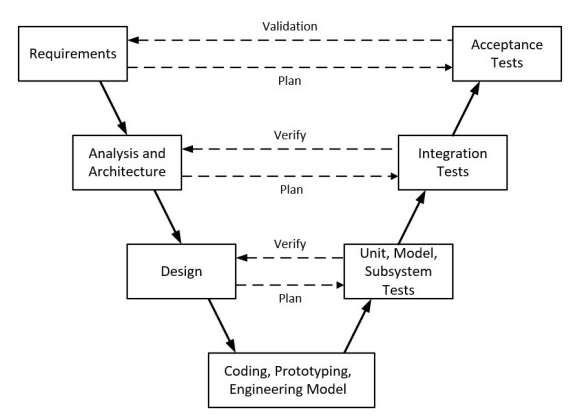

# Introduction to Software Development Lifecycle

A **software process** is a set of activities (requirements specification, 
design, implementation, verification, evolution) and associated results that 
produce a software product.

See: [Phases of Software Development](https://github.com/teiniker/teiniker-lectures-embedded-softwaredesign/blob/master/introduction/README.md)

Different types of systems need different development processes:
- Real-time software in a car has to be completely specified before 
    development begins
- In e-commerce systems, the specification and the program are  
    usually developed together.

> A **software process model** is a simplified description of a software process 
> that represents one view of that process.
> Process models may include activities that are part of the software process 
> and the roles of people involved in software engineering.

There are general paradigms of software development:
- **The waterfall approach**: This takes the fundamental process activities and 
    represents them as separate process phases. 
- **Iterative development**: This approach interleaves the activities of specification, 
    development and validation. 
- **Component-based software development**: This approach is based on the existence 
    of a significant number of reusable components.

## Waterfall Model

The Waterfall Model is one of the earliest and most traditional software development 
life cycle (SDLC) approaches. 

> The **Waterfall Model** follows a linear and sequential flow, where each phase must 
> be fully completed before the next one begins. 
> Like water flowing downward through steps of a waterfall.

Phases of the Waterfall Model:

* **Requirements Analysis**:
    Collect and document all system requirements.

* **System Design**:
    Create the architecture, data models, and system 
    design based on requirements.

* **Implementation (Coding)**:
    Developers write the code according to the design 
    specifications.

* **Integration & Testing**
    Integrate modules and test the complete system for 
    defects, performance, and compliance.

* **Deployment**:
    Release the system to users or customers.

* **Maintenance**:
    Fix issues, apply updates, and support the software 
    after deployment.

The **advantages** of the waterfall model are that documentation 
is produced at each phase and that it fits with other engineering 
process models.

Its **major problem** is its inflexible partitioning of the project 
into distinct stages.

**The waterfall model should only be used when the requirements 
are well understood and unlikely to change radically during system development**.

## V-Model

The V-Model (Verification and Validation Model) is an extension of 
the Waterfall Model that emphasizes a parallel **relationship between 
development phases and testing phases**.

Its name comes from its V-shaped diagram: the **left side represents verification** 
(planning and designing), and the **right side represents validation** 
(testing and evaluation).

**Left Side: Verification Phases (Planning & Design)**

* **Requirements Analysis**: 
    - Define and document user needs.
    - Corresponds to Acceptance Testing on the right side.

* **Analysis and Architecture**: 
    - Define the overall system architecture and components. 
    - Corresponds to System Testing.
    - Break system into modules, define interfaces and data flow.
    - Corresponds to Integration Testing.

* **Design**:
    - Detailed design of each module and its logic.
    - Corresponds to Unit Testing.

**Right Side: Validation Phases (Testing)**

* **Unit Testing**:
    - Tests individual modules based on the Design.

* **Integration Testing**:
    - Ensures modules work together as defined in the Architecture.

* **Acceptance Testing**:
    - Validates the entire system against the System Design.
    - Checks the system against user requirements before release.

The V-Model offers a clear, systematic approach with **early test planning** 
that helps reduce defects, making it especially **effective for projects 
with stable, well-defined requirements**. 
Its strong emphasis on verification and validation ensures high-quality outcomes.

The V-Model is **inflexible** because changes are difficult once phases 
are completed and it **requires fully defined requirements from the start**, 
making it slow and less suitable for complex or evolving projects.

## Agile Methods

Agile methods in software engineering focus on **iterative development**, 
where work is completed in small increments that allow for 
**frequent feedback** and adaptation. 

### Agile Manifesto 

The Agile Manifesto (2001) is the **foundational document for Agile 
software development**. It outlines 4 core values and 12 guiding 
principles that emphasize flexibility, collaboration, and continuous 
improvement.

The **Core Values** of the Agile Manifesto:

* **Individuals and interactions over processes and tools**:
    Agile prioritizes people—communication, teamwork, and 
    collaboration—because good individuals can adapt even when 
    tools or processes fall short.

* **Working software over comprehensive documentation**:
    Documentation matters, but delivering functional software 
    is more valuable. Agile avoids excessive paperwork that 
    slows progress.

* **Customer collaboration over contract negotiation**:
    Instead of locking everything into rigid contracts, Agile 
    focuses on continual feedback and partnership with customers.

* **Responding to change over following a plan**:
    Agile embraces change, even late in development, because 
    adapting leads to better results than forcing outdated plans.

The **Principles** of the Agile Manifesto:

* **Customer satisfaction through early and continuous delivery**:
    Deliver value frequently so customers see progress and 
    give feedback.

* **Welcome changing requirements, even late**:
    Change is a competitive advantage in Agile.

* **Deliver working software frequently**:
    Short, incremental cycles (iterations/sprints).

* **Close collaboration between business and developers**:
    Daily engagement ensures alignment and reduces 
    misunderstandings.

* **Build projects around motivated individuals**:
    Give teams the environment, support, and trust they need.

* **Face-to-face communication is best**:
    Direct communication reduces delays and improves clarity.

* **Working software is the primary measure of progress**:
    Output is tangible value—not documents or hours worked.

* **Promote sustainable development**:
    Teams should maintain a consistent pace indefinitely 
    (no burnout cycles).

* **Continuous attention to technical excellence and good design**:
    Quality enables faster development over time.

* **Simplicity, the art of maximizing work not done, is essential**:
    Focus on what truly matters; avoid over-engineering.

* **Self-organizing teams create the best designs and solutions**:
    Teams decide how to work; autonomy fosters innovation.

* **Regular reflection and adaptation**:
    Retrospectives help teams continuously improve processes 
    and collaboration.

## References

* Agile Methods 
    - [Manifesto for Agile Software Development](https://agilemanifesto.org/)

_Egon Teiniker, 2025, GPL v3.0_