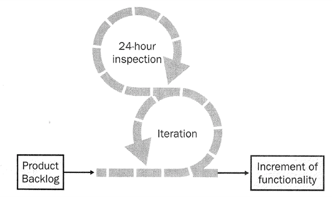
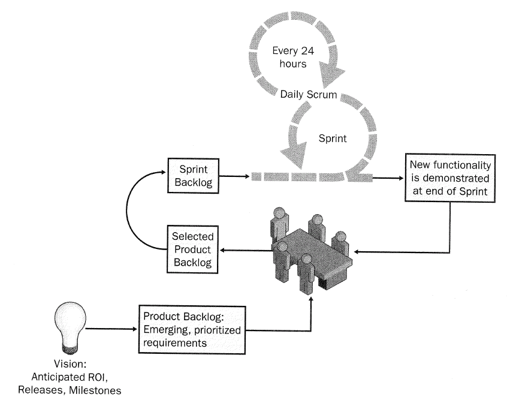

# Scrum 

> **Scrum** is a management and control process that cuts through complexity 
> to focus on building software that meets business needs.

_Figure: Skeleton of Scrum (Schwaber and Beedle, 2002)_

Using Scrum, teams develop products **incrementally and empirically**.

Scrum is based on an iterative, incremental process: 

* The lower circle represents an **iteration of development** activities that 
occur one after another. The output of each iteration is an **increment of the product**.

* The upper circle represents the **daily inspection** that occurs during the iteration.
    
* Driving the iteration is a **list of requirements**.

* At the start of an iteration, the team reviews what it must do.

* It then selects what it believes it can turn into an increment of potentially 
    shippable functionality be the end of the iteration.

* The team is left then alone to make its best effort for the rest of the iteration.

* At the end of the iteration, the team presents the increment of functionality it built.

## Scrum Roles

Scrum defines the following roles:

* **Product Owner (PO)**:
    - The PO is responsible for representing the interests of everyone with a stake 
    in the project and its resulting system.
    - The PO creates the project’s initial overall requirements, return on investment 
    (ROI) objectives, and release plans.
    - The list of requirements is called **Product Backlog**.
    * The PO is responsible for using the Product Backlog to ensure that the most 
    valuable functionality is produced first (by frequently **prioritizing the Product Backlog**).

* **Team**:
    - The team is responsible for developing functionality.
    - Teams are self-managing, self-organizing, and **cross-functional**.
    - Teams are responsible for figuring out how to turn Product Backlog into 
    an increment of functionality within an iteration.
    - Team members are collectively responsible for the success of each iteration.

* **Scrum Master (SM)**:
    - The SM is responsible for the Scrum process.
    - The SM is responsible for teaching Scrum to everyone involved in the project.
    - The SM is responsible for implementing Scrum so that it fits within 
    an organization’s culture and still delivers the expected benefits, and for 
    ensuring that everyone follow Scrum rules and practices. 

## Scrum Flow

_Figure: Scrum Flow (Schwaber and Beedle, 2002)_ 

* A Scrum project starts with a **vision** of the system to be developed. 
* The PO formulates a plan for delivering the vision creating the **Product Backlog** 
    (a list of functional and non-functional requirements). The Product Backlog is prioritized.
* All work is done in **Sprints**. Each Sprint is an iteration of 30 consecutive calendar days.
* Each Sprint is initiated with a **Sprint planning** meeting, where the PO and Team get 
    together to collaborate about what will be done for the next Sprint. 
    Sprint planning meetings cannot last longer than **8 hours**.
* Because the Team is responsible for managing its own work in tasks, it needs 
    a plan to start the Sprint - the **Sprint Backlog**.
* Every day, the team gets together for a 15 minute meeting called **Daily Scrum**, 
    where each Team member answers three questions:
    - What have you done on this project since the last meeting?
    - What do you plan on doing between now and the next meeting?
    - What problems stand in the way of you meeting your commitments to this Sprint and this project?
* At the end of the Sprint, a **Sprint review meeting** is held. This is a 4 hour meeting 
    at which the Team presents what was developed during the Sprint to the PO and other stakeholders.
* After the Sprint review and prior the next Sprint planning meeting, the SM holds a (3 hour time-boxed) 
    **Sprint retrospective meeting** with the Team.
    The SM encourages the Team to revise its development process to make it more effective 
    and enjoyable for the next Sprint.

## Scrum Artifacts

Scrum introduces only a few new artifacts:

* **Product Backlog (PB)**:
    The requirements for the system are listed in the PB. The PB is never complete, it evolves 
    as the product and the environment in which it will be used evolves.

* **Burndown chart**: A burndown chart shows the amount of work remaining across time. This is 
    an excellent way of visualizing the progress of the project.

* **Sprint Backlog (SB)**: The SB describes the tasks that a Team defines for turning the 
    PB it selected for a Sprint into an increment of potentially shippable product functionality. 
    Tasks should be divided so that each takes roughly 4 to 16 hours. 

* **Increment of Shippable Product Functionality**: The increment consists of tested, well-structured, 
    and well-written code that has been built into an executable. This also includes that the user 
    operation of the functionality is documented. 

## References

* Ken Schwaber, Mike Beedle. **Agile Software Development with Scrum**. Prentice Hall, 2002
* Ken Schwaber. **Agile Project Management with Scrum**. Microsoft Press, 2004

_Egon Teiniker, 2025, GPL v3.0_